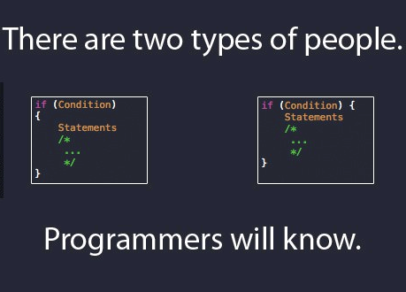
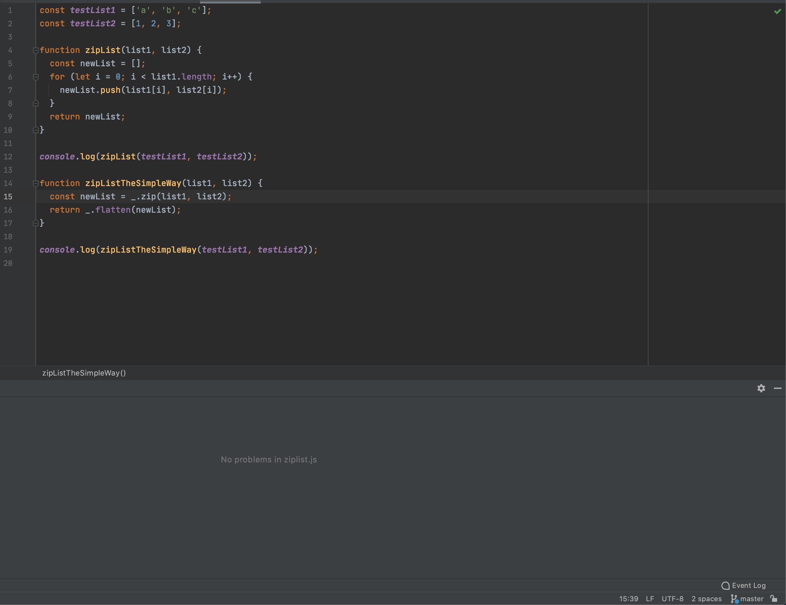

## A Trick to Neat Code?

When I first started coding in ICS 111, one of the first things I learned was coding standards. I remember my professor explaining to me what coding standards were, and then proceeded to establish his own coding standards for his class. At the time, all the rules that needed to be followed, on top of just learning how to code was overwhelming.  When I started to use the coding standard in my code, I realized something, that I hated it. I saw it as extra work on top of the already difficult coding assignments that really tested my logic and reasoning. Over time, as I went through more classes, repeatedly using coding standards over and over in my assignments, I realized that they were super beneficial to producing legible code. That’s when I made adding standards to my code habit. It made reading my code not only easier for myself, but for others as well. For me, coding standards are just as important as the code itself. So naturally when I found out about ESLint, and that there was a way to make coding standards not only neater, but easier, I was very excited. 

## A New View on Standards

When we started to work with IntelliJ Idea, I was very excited. Working in a new development environment and learning the different ways it can be used has always been interesting to me and is one of the reasons why I like coding. When I first opened IntelliJ I was blown away. There were so many different languages that could be used, and the layout was very clean and organized. It had so much color and flavor when it was launching, much better than that of the JGrasp development environment I was used to when learning about Java. I could even test my code in a browser console, which I thought was so cool because it was something I had never done before. And that’s when I found out about ESLint and a new way of including coding standards. Learning about this new way of implementing coding standards blew my mind. I thought to myself “So you’re telling me I can implement this to show all of the errors in my code? Without me having to tediously look for the errors. Sweet!”. But of course, with every good thing comes its hurdles.

## Pushing Through the Curve

Learning how to navigate and use IntelliJ already proved to be a confusing task for me, even following the videos that my professor had provided. It was an environment I was not used to, and a lot of things were new to me. Implementing different files, getting used to running my code in the Google Chrome browser, and configuring all the right settings to make everything run as needed were all things that I had never done before. Eventually I finally got the hang of IntelliJ, and that’s when I found out that I had to download files and navigate through the system shell in order to implement the coding standard mechanism. I started to feel discouraged about implementing ESLint, there were so many steps! I had to download files into the project directory, run npm install in the system terminal, and configure a bunch of settings in IntelliJ and my laptop just so I can get everything to properly work. But even though I had these thoughts of discouragement, I still forced myself to do all the necessary steps that I knew would make my life easier in the long run. After hours of troubleshooting and frustration, I was finally able to get ESLint to properly work with IntelliJ, and boy was it worth it. 

## The Green Checkmark

It was everything that I thought it would be, and more. My indentations, function names, quotation marks, and even new line and typo errors all showed up when I decided to write some code. This made coding so much easier, and also made me realize how unorganized my code could be. I would no longer have to look through hundreds of lines of code just to find out a line was missing a semicolon, or a function call was misspelt. It was all marked for me! Then, I decided to hover my mouse over an error that was marked by ESLint, and boom; it showed what the problem was, and what I could do to correct it.  I was stoked! I was also informed that a green checkmark on the top right of the screen would appear when there are no coding standard issues with the code, which I found so incredibly useful and convenient. That’s when I knew going through all the trouble of configuring everything in IntelliJ, along with the sweat and frustration that came with it, was worth it. That moment I knew my coding life and my coding habits would change forever, and I now strive to achieve that green checkmark on the top right of my screen. Achieving that green checkmark gives me confidence that my code at that point is the cleanest that it can possibly be. 
On the left is an example of my code on intelliJ and the green checkmark on the top right of the program.

## Setting the Standards

My experience with ESLInt and IntelliJ has been great. I would have never thought that there would be a development environment that would mark your errors for you, and even though it required a lot of work to get past the learning curve of learning a new IDE and implementing ESLint, it was all worth it in the end. Knowing that I will be using both IntelliJ and ESLint more throughout my future in my software engineering class gives me a sense of comfort, because I know that I can improve my skills while also producing clean and elegant code, and I plan on continuing to use ESLint for future classes and careers.

