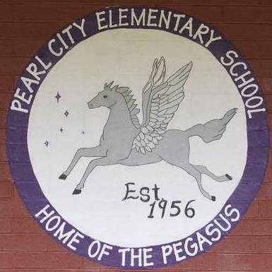

During my time working as an After-School Aplus program leader at Pearl City Elementary school, we would do yearly projects with our specified group of students called "Finales". These finales consisted of students performing in front of an audience, all of which were parents, staff, or other students. The purpose of the finales were to help students focus on arts and creativity and the performances usually consisted of either singing or dancing. It also helps students to build coordination skills, teamwork skills, and to overall just have fun. My role in these finales as a group leader was to help coordinate these finales, teaching the students how to dance and building the confidence to perform in front of others. 

Coordinating these finales helped improve my leadership skills, as well as the ability to work well with people of all ages. It also helped me become a better teacher, since most of the time the students would need some help in learning dance moves. Not only did I need to help coordinate the choreography of the dances, but I would also coordinate with the rest of the Aplus staff with tasks such as where the groups would sit, the order in which the groups will perform, and to set up a presentable environment that would help to engage the audience in the performances. 

