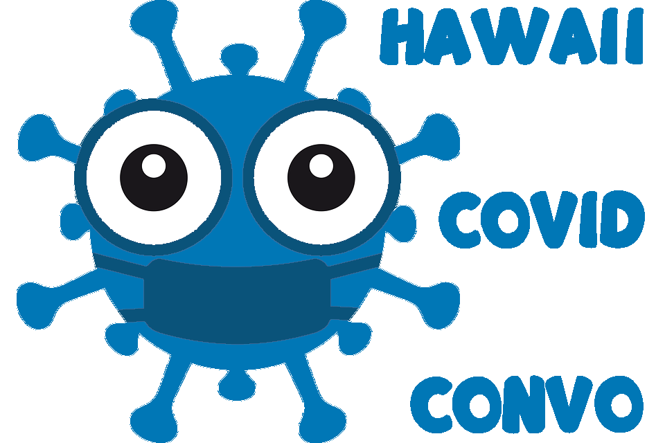

My first semester at UH Manoa was a tough one. There was a significant jump in difficulty for my classes, and the semester was amongst the COVID-19 pandemic, so all classes were taught online. But there once class stood out to me, and that was ICS 314, software engineering. I did not know what to expect for the class, but I knew that it would be difficult and intense. Fast forward to the end of the semester I realized that I really had fun developing in the class. For our final project we had to create a fully functional web application that would allow us to demonstrate the skills we learned in the class. We were to work in groups of four people and choose one application out of the many options we were given to try and create. Our group ended up choosing to create a Hawaii COVID-19 chatbot application that allowed users to ask the chat-bot a question regarding COVID-19, which they would then receive an answer to by the chat-bot.  

Our group ended up creating a fully functioning chat-bot application with many different implementations. We added a home page, an about page, a user feedback page, and an analytics page that would display the user feedback to a logged in user so that adjustments to the application could be made based off of reviews. Our group also managed to implement responses to more than 50 different questions that could be asked about COVID-19. To check out our application, you can click on this link.

Our group approached this project with issue driven project management, where we assigned lightweight tasks consistently to each group member. This way, our group members were able to work on their own individual tasks without causing any issues or overrides to the tasks that the other members were working on. I contributed to this project by doing research on the questions and the answers that our chat-bot could receive and provide back to the user. I also researched and helped implement the chat-bot itself using Google Dialogflow, which is a natural language platform that helps with implementing conversational user interfaces into applications. I was also assigned the task of creating user feedback forms, where users of our application are able to fill out a form and provide feedback on what they think can be improved about the application. This feedback would be later displayed to a user that had an account with our website. As of now, I consider this project to be my biggest accomplishment as an aspiring software engineer. 

This project helped me develop and sharpen a lot of my skills. It required organization and time management skills to make sure that we would meet each milestone’s requirements, as well as good communication skills with group members to make sure that we were all completing our tasks and also keeping up to date with the progress of the project. This project also helped sharpen my problem-solving skills, as there were a lot of issues that we had run into during the development progress that required a lot of trial and error and testing. To view our chat-bot application’s organization page, you can click here. If you would like to learn more about our application, you can visit our projects home page here. 

